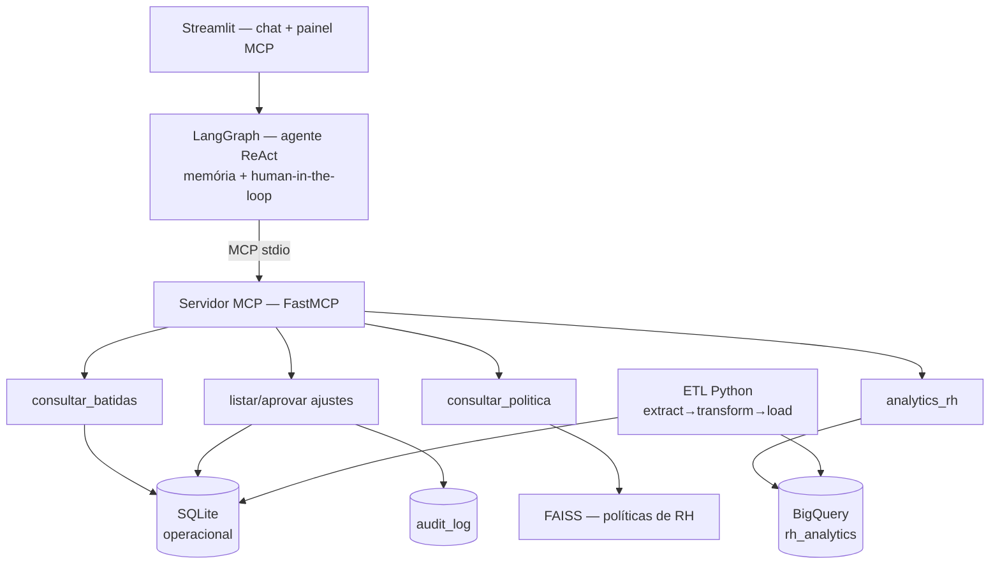

# 🕐 HR Agent MCP

Agente conversacional de RH que substitui telas estáticas de sistema de ponto
por uma interface de conversa — com **MCP**, **LangGraph**, **RAG** e **BigQuery**.

**🔗 Demo online:** <link Streamlit Cloud> (senha: solicitar) · **CI:** <badge>

## O que ele faz

O agente atende quatro tipos de pedido em linguagem natural, todos via chat:

- **Consulta de batidas** — "como foram as batidas da Ana nas últimas duas
  semanas?" retorna o histórico, com atrasos e batidas incompletas
  destacados.
- **Dúvidas de política, com fonte** — "qual a tolerância de atraso?" é
  respondido com RAG sobre as políticas de RH da empresa, citando o
  documento de origem, não apenas um resumo genérico.
- **Aprovação de ajuste com confirmação humana** — pedidos de escrita (por
  exemplo, aprovar um ajuste de ponto) passam por um card de confirmação
  explícito antes de qualquer alteração no banco, e ficam registrados em
  trilha de auditoria.
- **Analytics no BigQuery** — perguntas analíticas ("qual equipe acumulou
  mais horas extras por mês?") geram SQL via LLM, que passa por uma camada
  de governança antes de tocar o warehouse.

GIF da demo aqui.

## Arquitetura



O sistema separa deliberadamente dois mundos: o **operacional** (SQLite,
leitura e escrita, latência baixa, dados do dia a dia como batidas e
ajustes) e o **analítico** (BigQuery, somente leitura, dados agregados para
perguntas de gestão). Essa separação evita que consultas analíticas pesadas
concorram com o caminho transacional e mantém o warehouse como uma cópia
derivada e auditável, nunca como fonte de verdade para escrita. Por isso
toda operação de escrita — hoje, aprovar um ajuste de ponto — passa por
`interrupt` (o grafo pausa e devolve o controle à interface, que exige
confirmação humana explícita) e é registrada em `audit_log` antes de ser
considerada concluída: o agente nunca escreve silenciosamente.

## Capacidades demonstradas

| Capacidade | Onde está no código |
|---|---|
| MCP (servidor + client) | `mcp_server/server.py`, `agent/graph.py` |
| Orquestração de agente (LangGraph) | `agent/graph.py` |
| Human-in-the-loop (interrupt) | `agent/graph.py` (`_com_confirmacao`) |
| RAG (FAISS + embeddings) | `rag/index.py`, `data/politicas/` |
| ETL (extract→transform→load) | `etl/` |
| BigQuery + governança de SQL | `mcp_server/analytics.py`, `core/bq.py` |
| APIs Python / testes / CI | `mcp_server/db.py`, `tests/`, `.github/workflows/` |

## Rodando localmente

```bash
git clone <repo>
cd hr-agent-mcp
cp .env.example .env       # preencher OPENAI_API_KEY
uv sync
uv run python -m etl.pipeline
uv run streamlit run app/main.py
```

`APP_PASSWORD` é opcional em desenvolvimento (protege o app quando exposto
publicamente). BigQuery também é opcional: sem credencial configurada, o
agente segue funcionando normalmente e a tool de analytics degrada de forma
graciosa, informando que o recurso está indisponível em vez de falhar.

## BigQuery (opcional)

1. Criar um projeto no GCP Sandbox (gratuito, sem cartão de crédito).
2. Criar uma service account com papéis **BigQuery Data Editor** + **BigQuery
   Job User** nesse projeto (Data Editor cria datasets; Job User executa
   jobs de carga/consultas — privilégio mínimo).
3. Baixar a chave JSON da service account.
4. Preencher `GCP_PROJECT_ID` no `.env` com o id do projeto criado — sem
   essa variável o cliente BigQuery permanece desabilitado, mesmo com a
   credencial configurada.
5. Apontar `GOOGLE_APPLICATION_CREDENTIALS` para o caminho do arquivo (uso
   local) ou colar o conteúdo em `GCP_SERVICE_ACCOUNT_JSON` (uso no
   Streamlit Cloud, onde não há sistema de arquivos persistente).
6. Rodar `uv run python -m etl.pipeline` para carregar o dataset
   `rh_analytics` (tabela `agregados_mensais`) no BigQuery.

## Dados

Todos os dados são 100% sintéticos, gerados com Faker (seed 42): colaboradores,
batidas de ponto, ajustes e políticas de RH são personas e documentos
fictícios, criados exclusivamente para esta demonstração. Nenhum dado real
de nenhuma empresa é usado ou referenciado em nenhum ponto do projeto.

## Stack

- Python 3.11+
- [uv](https://github.com/astral-sh/uv) (gestão de ambiente e dependências)
- [mcp](https://modelcontextprotocol.io/) / FastMCP (servidor MCP stdio)
- [LangGraph](https://langchain-ai.github.io/langgraph/) (orquestração do agente ReAct)
- langchain-mcp-adapters (cliente MCP do agente)
- langchain-openai (gpt-4o-mini)
- langchain-community / FAISS (RAG)
- pandas (ETL)
- Faker (geração de dados sintéticos)
- google-cloud-bigquery
- Streamlit (interface de chat)
- pytest (27 testes)
- ruff (lint)
