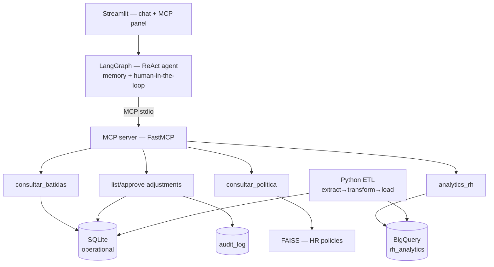

# 🕐 HR Agent MCP

Conversational HR agent that replaces static time-tracking screens with a chat
interface — built with **MCP**, **LangGraph**, **RAG** and **BigQuery**.

**🔗 Live demo:** [hr-agent-mcp-cyd.streamlit.app](https://hr-agent-mcp-cyd.streamlit.app/) (password: on request) · [](https://github.com/cydgxbriel/hr-agent-mcp/actions/workflows/ci.yml)

## What it does

The agent handles four kinds of natural-language requests, all through chat:

- **Time-punch queries** — "how were Ana's punches over the last two weeks?"
  returns the history, with late arrivals and incomplete punches highlighted.
- **Policy questions, with sources** — "what is the lateness tolerance?" is
  answered with RAG over the company's HR policies, citing the source document
  rather than a generic summary.
- **Adjustment approval with human confirmation** — write requests (for example,
  approving a time-punch adjustment) go through an explicit confirmation card
  before anything changes in the database, and are recorded in an audit trail.
- **Analytics on BigQuery** — analytical questions ("which team accumulated the
  most overtime per month?") generate SQL via LLM, which passes through a
  governance layer before touching the warehouse.

▶️ **Try it live:** [hr-agent-mcp-cyd.streamlit.app](https://hr-agent-mcp-cyd.streamlit.app/) — or follow the [3-minute walkthrough](DEMO.md).

## Architecture



The system deliberately separates two worlds: the **operational** side (SQLite,
read-write, low latency, day-to-day data such as punches and adjustments) and the
**analytical** side (BigQuery, read-only, aggregated data for management
questions). This separation keeps heavy analytical queries from competing with
the transactional path, and keeps the warehouse as a derived, auditable copy —
never a source of truth for writes.

## Technical decisions

- **Tools behind an MCP server (stdio)** rather than in-process functions: the
  agent and the tool layer evolve independently, and any MCP-compatible client
  can reuse the same server.
- **Every write goes through `interrupt`** — the graph pauses and hands control
  back to the UI, which requires explicit human confirmation — and is recorded
  in `audit_log` before it counts as done. The agent never writes silently.
- **LLM-generated SQL passes a governance layer** before touching BigQuery,
  instead of trusting the model with raw warehouse access.
- **Two-layer eval scoring** — deterministic checks (tool choice, regex, gate
  state) plus LLM-as-judge only for what string matching cannot cover.

## Capabilities demonstrated

| Capability | Where in the code |
|---|---|
| MCP (server + client) | `mcp_server/server.py`, `agent/graph.py` |
| Agent orchestration (LangGraph) | `agent/graph.py` |
| Human-in-the-loop (interrupt) | `agent/graph.py` (`_com_confirmacao`) |
| RAG (FAISS + embeddings) | `rag/index.py`, `data/politicas/` |
| ETL (extract→transform→load) | `etl/` |
| BigQuery + SQL governance | `mcp_server/analytics.py`, `core/bq.py` |
| Agent evaluation (evals) | `evals/`, [`EVALS.md`](EVALS.md) |
| Python APIs / tests / CI | `mcp_server/db.py`, `tests/`, `.github/workflows/` |

## Evaluation (evals)

The agent is evaluated end-to-end by a 28-case suite across 8 categories
(routing, operational, policies, analytics, write gate, governance,
disambiguation and cross-source questions), with two-layer scoring —
deterministic (tool chosen, regex, gate state) plus LLM-as-judge for what string
matching cannot cover. Write cases run against an isolated copy of the database.
Run with `uv run python -m evals.run`; results live in [`EVALS.md`](EVALS.md).

## Running locally

```bash
git clone https://github.com/cydgxbriel/hr-agent-mcp.git && cd hr-agent-mcp
cp .env.example .env && uv sync        # fill in OPENAI_API_KEY
uv run python -m etl.pipeline && uv run streamlit run app/main.py
```

`APP_PASSWORD` is optional in development (it protects the app when publicly
exposed). BigQuery is optional too: without configured credentials the agent
keeps working and the analytics tool degrades gracefully, reporting the feature
as unavailable instead of failing.

## BigQuery (optional)

1. Create a project in the GCP Sandbox (free, no credit card).
2. Create a service account with **BigQuery Data Editor** + **BigQuery Job
   User** roles in that project (Data Editor creates datasets; Job User runs
   load jobs and queries — least privilege).
3. Download the service account's JSON key.
4. Set `GCP_PROJECT_ID` in `.env` to the new project id — without this variable
   the BigQuery client stays disabled even with credentials configured.
5. Point `GOOGLE_APPLICATION_CREDENTIALS` at the key file path (local use) or
   paste the file contents into `GCP_SERVICE_ACCOUNT_JSON` (Streamlit Cloud,
   which has no persistent filesystem).
6. Run `uv run python -m etl.pipeline` to load the `rh_analytics` dataset
   (table `agregados_mensais`) into BigQuery.

## Data

All data is 100% synthetic, generated with Faker (seed 42): employees, time
punches, adjustments and HR policies are fictional personas and documents
created exclusively for this demonstration. No real data from any company is
used or referenced anywhere in the project.

## Stack

- Python 3.11+
- [uv](https://github.com/astral-sh/uv) (environment and dependency management)
- [mcp](https://modelcontextprotocol.io/) ≥1.2 / FastMCP (stdio MCP server)
- [LangGraph](https://langchain-ai.github.io/langgraph/) ≥0.2.60 (ReAct agent orchestration)
- langchain-mcp-adapters ≥0.1 (the agent's MCP client)
- langchain-openai ≥0.2.10 (gpt-4o-mini)
- langchain-community ≥0.3.10 / FAISS ≥1.8 (RAG)
- pandas ≥2.2 (ETL)
- Faker ≥30 (synthetic data generation)
- google-cloud-bigquery ≥3.25
- Streamlit ≥1.40 (chat interface)
- pytest ≥8 (28 tests)
- ruff (lint)
